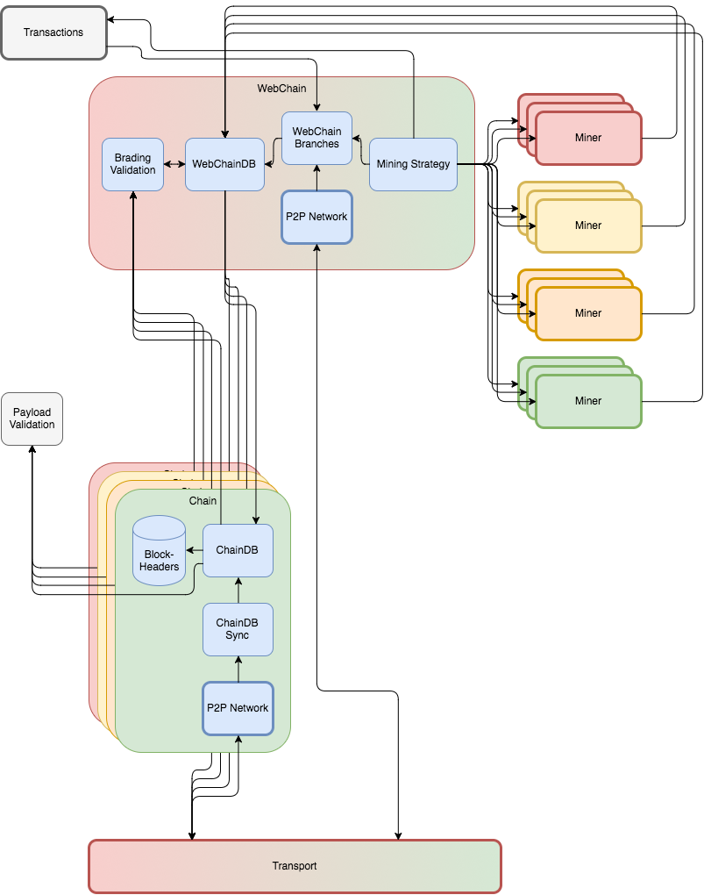

**NOTE**: The Kadena Mainnet stopped producing blocks on 2025-11-15T23:26:15Z.
The final cut is

```json
{
  "hashes": {
    "0": {
      "height": 6357351,
      "hash": "CNHrpXbArOLo_cgVHt2uxR9MfNtp_1XFmeQEwM9T-_k"
    },
    "1": {
      "height": 6357350,
      "hash": "iNNoM2Q9u4YmyK0b2pDHcnCHIkW23kbPQhCOT1zxQiA"
    },
    "2": {
      "height": 6357351,
      "hash": "3Kzxjmlr3v_y-HXojOOZUf-vDd4DsX_egHMIm6eelmo"
    },
    "3": {
      "height": 6357350,
      "hash": "uRdnAnLhZ4Qc3E_yD5XeSmh_tEU0Wo0wSZl01UAlji8"
    },
    "4": {
      "height": 6357352,
      "hash": "Jvvh057gHVx4G_9yk0MysTdz7mMcW3ceFCByIy6s0js"
    },
    "5": {
      "height": 6357351,
      "hash": "Bgn1kKV-ecYytVWzHvM-sqOjryfeznpbOX6DPw8zwdM"
    },
    "6": {
      "height": 6357351,
      "hash": "_5_sGzH0zVUQA5ca5q2Gv3Oyx0YgwSLrz_pjXBDg-ME"
    },
    "7": {
      "height": 6357352,
      "hash": "_Ls_T4m_cx69betxqwzWctKE4mB0eA893xVUjCMQRe0"
    },
    "8": {
      "height": 6357351,
      "hash": "uaEJWHmeURrAN1NfQnbOn2kWOur_MdADLRzsJ7LXHbU"
    },
    "9": {
      "height": 6357352,
      "hash": "zAuqJpSTj-ZRCfgv1ENnLaw4CVGlGmIHXWQUvoW3d9Q"
    },
    "10": {
      "height": 6357351,
      "hash": "BdtBPGPtQwtNSmNhxcfhRkg7kveo6rT3vFBnLiVUZbo"
    },
    "11": {
      "height": 6357351,
      "hash": "fbnLuG-dRWyBbJlT8d0o2oM5JNegZMiT7g0gjUpx3bo"
    },
    "12": {
      "height": 6357352,
      "hash": "cUJMScJO6dzqsZA2zSmXGJM01vxBjqsdpZAIqQch-tM"
    },
    "13": {
      "height": 6357351,
      "hash": "WNFyaTjQZ6c0_b67AQ5u3FsvPFvNt9YOhoBCIikjwp0"
    },
    "14": {
      "height": 6357351,
      "hash": "gelSWQWTFe62OG3064wvLEB81hHB7oUeYm5u04Zyi64"
    },
    "15": {
      "height": 6357350,
      "hash": "6jaP_ipxnGKla0-2wuXRYjf2mzc2ZsrBP9Yv18zy4WE"
    },
    "16": {
      "height": 6357349,
      "hash": "CJB2_VHPSQBBa50ki0lgE4HX4RUbL4h8wkxK9Z6CFUw"
    },
    "17": {
      "height": 6357350,
      "hash": "kcahBEUEON_j7gYscOdayHd773JU_tzGBX_FJjmriGk"
    },
    "18": {
      "height": 6357351,
      "hash": "S4jq2NbsLR57mdSXR3XLJ2_qLrVvGOsOqvlNEW-cnGc"
    },
    "19": {
      "height": 6357352,
      "hash": "t8tjoZ-rfr0yUIpbLKqgOQjRO3hYFDEWOwgY5n9taXQ"
    }
  },
  "origin": null,
  "weight": "JhaBsLA6L5pAdy4AAAAAAAAAAAAAAAAAAAAAAAAAAAA",
  "height": 127147019,
  "instance": "mainnet01",
  "id": "PY1Vz7vpwsAzEnIr5Z_pOQGIRm-ZWuYv_u9_o1OLZ94"
}
```

<p align="center">

</p>

<p>&nbsp;</p>

# Kadena Public Blockchain

Kadena is a fast, secure, and scalable blockchain using the Chainweb consensus
protocol. Chainweb is a braided, parallelized Proof Of Work consensus mechanism
that improves throughput and scalability in executing transactions on the
blockchain while maintaining the security and integrity found in Bitcoin.

Read our [whitepapers](https://www.kadena.io/whitepapers):

- [Chainweb: A Proof-of-Work Parallel-Chain Architecture for Massive Throughput](https://d31d887a-c1e0-47c2-aa51-c69f9f998b07.filesusr.com/ugd/86a16f_029c9991469e4565a7c334dd716345f4.pdf)
- [Agent-based Simulations of Blockchain Protocols illustrated via Kadena's *Chainweb*](https://d31d887a-c1e0-47c2-aa51-c69f9f998b07.filesusr.com/ugd/86a16f_3b2d0c58179d4edd9df6df4d55d61dda.pdf)

For additional information, press, and development inquiries, please refer to the Kadena [website](https://kadena.io)

## Table of Contents

- [Kadena Docs Site](#docs)
- [Installing Chainweb](#installing-chainweb)
- [Bootstrap Nodes](#bootstrap-nodes)
- [Configuring, running, and monitoring the health of a Chainweb Node](#configuring-running-and-monitoring-the-health-of-a-chainweb-node)
- [Mining for a Chainweb Network](#mine-for-a-chainweb-network)
- [Chainweb Design](#chainweb-design)
  - [Component Structure Details](#component-structure)
  - [Architecture Overview](#architecture-overview)

## Docs

The Kadena Docs site, which can be found [here](https://kadena-io.github.io/kadena-docs/) serves as a source of information about Kadena. You can find information about how to interact with the public chain, including how to get keys, view network activity, explore blocks, etc. [here](https://kadena-io.github.io/kadena-docs/Public-Chain-Docs).

If you have additions or comments, please submit a pull request or raise an issue - the GitHub project can be found [here](https://github.com/kadena-io/kadena-docs)

## Installing Chainweb

Minimal recommended hardware requirements for nodes are:

* 2 CPU cores
* 4 GB of RAM
* 250 GB SSD or fast HDD
* Public IP address

If the node is also used as API server for Pact, mining, or chainweb-data: 4 CPU cores and 8GB of RAM.

### Docker (all batteries included)

A docker image is available from
[here](https://hub.docker.com/r/kadena/chainweb-node) and can be used with
the following commands:

```shell
# Initialize the database (optional, but avoids several hours of initial db synchronization)
docker run -ti --rm -v chainweb-db:/root/.local/share/chainweb-node/mainnet01/0/ kadena/chainweb-node /chainweb/initialize-db.sh
```

```shell
# Run a chainweb-node in Kadena's mainnet
docker run -d -p 443:443 -v chainweb-db:target=/root/.local/share/chainweb-node/mainnet01/0/ kadena/chainweb-node
```

Further details can be found in the [README of the docker
repository](https://hub.docker.com/r/kadena/chainweb-node).

### Docker (bare metal)

A docker image with just a bare chainweb-node binary and its dependencies is
available at `ghcr.io/kadena-io/chainweb-node/ubuntu:latest`. It is up to the
user to setup and manage the database and configure the node to their needs.

```sh
docker run -p 1789:1789 -p 80:80 --entrypoint=/chainweb/chainweb-node ghcr.io/kadena-io/chainweb-node/ubuntu:latest --help
docker run -p 1789:1789 -p 80:80 --entrypoint=/chainweb/chainweb-node ghcr.io/kadena-io/chainweb-node/ubuntu:latest --print-config
```

Examples for running docker compose setups for chainweb-node for different usage scenarios
can be found in [this repository](https://github.com/kadena-io/docker-compose-chainweb-node).

### Ubuntu Linux

The following packages must be installed on the host system:

*   ubuntu-20.04:
    ```bash
    apt-get install ca-certificates libmpfr6 libgmp10 libssl1.1 libsnappy1v5 zlib1g liblz4-1 libbz2-1.0 libgflags2.2 zstd
    ```

*   ubuntu-22.04:
    ```bash
    apt-get install ca-certificates libmpfr6 libgmp10 libssl1.1 libsnappy1v5 zlib1g liblz4-1 libbz2-1.0 libgflags2.2 zstd
    ```

Chainweb-node binaries for ubuntu-20.04 and ubuntu-22.04 can be found
[here](https://github.com/kadena-io/chainweb-node/releases).

Download the archive for your system and extract the binaries and place them
into a directory from where they can be executed.

At this point, you are ready to [run a Chainweb node](#configuring-running-and-monitoring-the-health-of-a-chainweb-node)

## Building from Source

*IMPORTANT NOTE: We recommend the use of officially released chainweb-node
binaries or docker images, which can be found in the
[release section of this
repository](https://github.com/kadena-io/chainweb-node/releases).
If you decide to build your own binaries, please make sure to only use
officially released and tagged versions of the code. Those versions are
extensively tested to ensure that they are compatible with all other nodes in
the chainweb network. It is generally not safe to run arbitrary builds of the
master branch in the Kadena mainnet.*

Chainweb is a [Haskell](https://www.haskell.org/) project. After cloning the
code with git from this GitHub repository the chainweb-node application can be
built as follows.

### Building with Cabal

In order to build with `cabal` you have to install `ghc-8.10.7` (Haskell compiler)
and `cabal >= 3.4` (Haskell build-tool)

*   [Linux / Mac](https://www.haskell.org/ghcup/)

You need to install the development versions of the following libraries:
`gflags`, `snappy`, `zlib`, `lz4`, `bz2`, `zstd`.

On apt based distribution these can be installed as follows:

```
apt-get install ca-certificates libssl-dev libmpfr-dev libgmp-dev libsnappy-dev zlib1g-dev liblz4-dev libbz2-dev libgflags-dev libzstd-dev
```

To build a `chainweb-node` binary:

```bash
# Only necessary if you haven't done this recently.
cabal update

# Build the project.
#
# After this, a runnable binary can be found by running `cabal list-bin chainweb-node`.
cabal build
```

### Building with Nix

Another way to build and run chainweb is to use the Nix package manager which
has binary caching capabilities that allow you to download pre-built binaries
for everything needed by Chainweb. For detailed instructions see [our
    wiki](https://github.com/kadena-io/pact/wiki/Building-Kadena-Projects).

When the build is finished, you can run chainweb with the following command:

```bash
./result/ghc/chainweb/bin/chainweb-node
```

## Bootstrap Nodes

Bootstrap nodes are used by chainweb-nodes on startup in order to discover other
nodes in the network. At least one of the bootstrap nodes must be trusted.

Chainweb node operators can configure additional bootstrap nodes by using the
`--known-peer-info` command line option or in a configuration file. It is also
possible to ignore the builtin bootstrap nodes by using the
`--enable-ignore-bootstrap-nodes` option or the respective configuration file
setting.

Bootstrap nodes must have public DNS names and a corresponding TLS certificate
that is issued by a widely accepted CA (a minimum requirement is acceptance by
the OpenSSL library).

Operators of bootstrap nodes are expected to guarantee long-term availability of
the nodes. The list of builtin bootstrap nodes should be kept up-to-date and
concise for each chainweb-node release.

If you like to have your node included as a bootstrap node please make a pull
request that adds your node to [P2P.BootstrapNodes module](src/P2P/BootstrapNodes.hs).

### Current Testnet Bootstrap Nodes

- us1.testnet.chainweb.com
- us2.testnet.chainweb.com
- eu1.testnet.chainweb.com
- eu2.testnet.chainweb.com
- ap1.testnet.chainweb.com
- ap2.testnet.chainweb.com

### Current Mainnet Bootstrap Nodes

All bootstrap nodes are running on port 443.

- us-e1.chainweb.com
- us-e2.chainweb.com
- us-e3.chainweb.com
- us-w1.chainweb.com
- us-w2.chainweb.com
- us-w3.chainweb.com
- jp1.chainweb.com
- jp2.chainweb.com
- jp3.chainweb.com
- fr1.chainweb.com
- fr2.chainweb.com
- fr3.chainweb.com

## Configuring, running, and monitoring the health of a Chainweb Node

**This section assumes you've installed the `chainweb-node` binary** somewhere
sensible, or otherwise have a simple way to refer to it. For running
`chainweb-node` via docker, please see the instruction above in this document or
visit our [docker repository](https://hub.docker.com/r/kadena/chainweb-node).

**Note:** Your node needs to be reachable from the public internet. You will
have to perform Port Forwarding if your machine is behind a router (by default
port 1789 is used by the node).

**NOTE**: When you start chainweb-node for the first time it creates a new
empty database and starts to synchronize and catch up with other nodes in the
Kadena network. This process takes a long time -- several days. It is much
faster (depending on hardware one to a few hours) to just synchronize the chain
database or get a snapshot of it and only rebuild the pact databases from the
chain-database. Please, consult the documentation of the docker images for
chainweb-node about details on how to obtain an initial chain database.

Run your node:

```bash
chainweb-node
```

The node will communicate with other nodes in a P2P network. By default it uses
port 1789 for the P2P communication.

Node services are exposed via the service API, by default on port 1848. The
service API includes `/info`, `/health-check`, Pact endpoints, the mining API
endpoints, GET endpoints for on-chain data (headers, payloads, cuts), and an
HTTP event stream of block header updates. Some of these are disabled by default
(e.g. mining API, and header updates).

While the P2P endpoint must be directly available from the public internet, it
is highly recommended to expose the service API only on a private network. When
service API endpoints are made available publicly it is recommended to use a
reverse proxy setup things like rate limiting, authentication, and CORS.

### Configuration

No particular configuration is needed for running Chainweb node on the Kadena
mainnet.

Use `chainweb-node --help` to show a help message that includes a brief
description of all available command line options.

A complete configuration file with the default settings can be created with

```sh
chainweb-node --print-config > config.yaml
```

This file can then be edited in order to change configuration values.

The command `chainweb-node --help` also provides descriptions of these
configuration values.

Given a configuration file or a set of command line options it is possible to
print out only those configuration values that are different from their
respective default:

```
chainweb-node --config-file=config.yaml --some-command-line-options --print-config-as=minimal
```


### Monitoring the health of a Chainweb Node

The following outlines how you can check that your `chainweb-node` is healthy

`chainweb-node` should be running from the public IP address and a port that is open to the other Chainweb nodes.

If you're behind a NAT, it is **VERY IMPORTANT** that your network allows
external nodes to connect to the node you are running.

```
$ chainweb-node --log-level <desired-log-level>
```

For production scenarios we recommend that you use log-level `warn` or `error`.
For troubleshooting or improved monitoring you can also use `info`.

Once your node is running, go through the following checks to verify that you have a healthy node:
*   run the command in your terminal:
    ```
    $ curl -sk "https://<public-ip>:<port>/chainweb/0.0/mainnet01/cut"
    ```
*   navigate to this website on your browser: [https://yourPublicIp:port/chainweb/0.0/mainnet01/cut](https://yourPublicIp:port/chainweb/0.0/mainnet01/cut)
*   check logs for whether services are started
*   check if the node is receiving cuts
*   look for errors in the logs
*   look for warnings in the logs

Usually, when a node is receiving and publishing cuts (i.e. block heights at every chain), it's working correctly.

The `/cut` endpoint will return the latest cut that your node has. It's possible that your node is falling behind, so make sure to compare its cut height with the cut heights of the bootstrap nodes. It's also possible that you are mining to a node that is catching up to the rest of the network. Before you start mining to a node, you SHOULD verify that this node has the most up-to-date cut.

You can get the cut height of any node by running the following:

```
$ curl -sk https://<bootstrap-node-url>/chainweb/0.0/mainnet01/cut | jq '.height'
```

## Mine for a Chainweb Network

Successful mining on mainnet requires specialized hardware (ASIC). The setup for solo mining involves running a chainweb-node with a configuration that enables mining and a [chainweb-mining-client](https://github.com/kadena-io/chainweb-mining-client/) that connects to the mining API of a chainweb-node and provides a Stratum API for the mining hardware (ASIC).

Detailed instructions for setting up all the infrastructure needed to start
mining using `docker compose` can be found in the documentation of [docker-compose-chainweb-node/mining-node](https://github.com/kadena-io/docker-compose-chainweb-node/tree/main/mining-node).

For example, to set up a chainweb node for mining, see [this](https://github.com/kadena-io/docker-compose-chainweb-node/blob/main/mining-node/docker-compose.yaml#L126) section of the docker-compose file.

Detailed mining client instructions can be found in the documentation of
[chainweb-mining-client](https://github.com/kadena-io/chainweb-mining-client/)

## Chainweb Design

### Component Structure

The Chainweb package contains the following buildable components:

*   `chainweb` library: It provides the implementation for the different
    components of a chainweb-node.

*   `chainweb-node`: An application that runs a Chainweb node. It maintains copies
    of a number of chains from a given Chainweb instance. It provides interfaces
    (command-line and RPC) for directly interacting with the Chainweb or for
    implementing applications such as miners and transaction management tools.

*   `chainweb-tests`: A test suite for the Chainweb library and chainweb-node.

*   `cwtool`: A collection of tools that are helpful for maintaining, testing,
    and debugging Chainweb.

*   `bench`: a collection of benchmarks

### Architecture Overview


