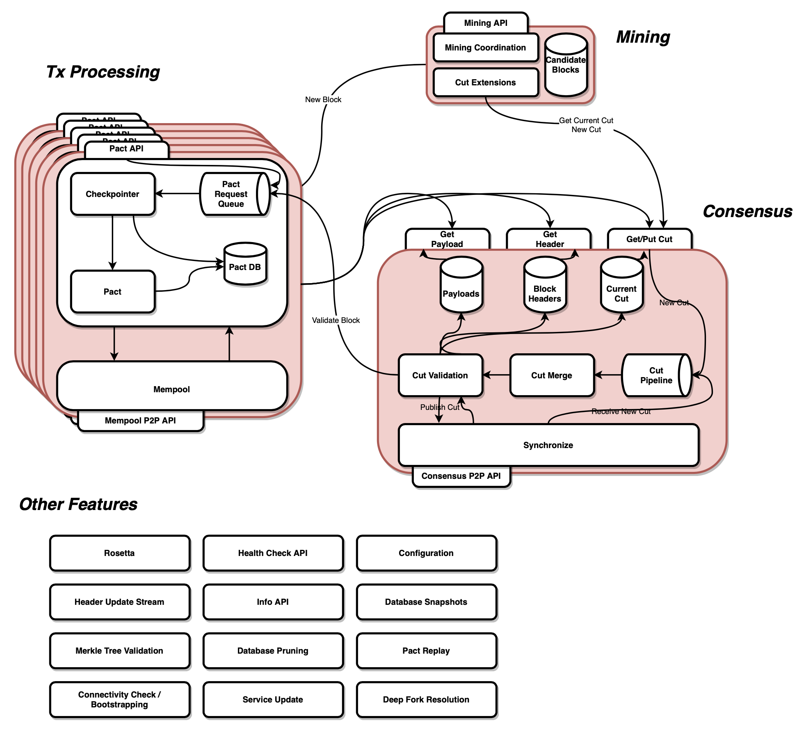

# Chainweb

A Proof-of-Work Parallel-Chain Architecture for Massive Throughput.
Read [our whitepaper](http://kadena.io/docs/chainweb-v15.pdf).

## Building from Source

### Building with Nix

The most reliable way to build chainweb is to use the
[Nix](https://nixos.org/nix/) package manager. Once you've installed Nix, use
the command `nix-build` from the repository root to build chainweb. To do
incremental builds, run `nix-shell` and then `cabal build` or `cabal new-build`
inside the resulting shell.

### Other Build Methods

Requirements:

- Cabal >= 2.2
- GHC >= 8.4
- (optional) Stack >= 1.9

To build the various Chainweb components, run one of the following:

```
# To build with cabal
cabal install --enable-tests

# To build with stack
stack install --test
```

This will build the chainweb library, the `chainweb-node` executable, the main
test suite, and a few extra example executables.

### Running the test suite

There have been some issues with the test suite running out of file
descriptors. This may cause test suite failures.  This can be fixed by raising
ulimits as follows:

On linux add the following line to `/etc/security/limits.conf`:

```
*               soft    nofile            1048576
```

On mac follow instructions [here](https://unix.stackexchange.com/questions/108174/how-to-persistently-control-maximum-system-resource-consumption-on-mac).
Create the file `/Library/LaunchDaemons/limit.maxfiles.plist`.


## Running a chainweb-node

A chainweb-node has two identifiers:

*   The node-id is a permanent identifier that is used for the `miner`
    field in the header of newly mined blocks. In its current form it is a
    placeholder for an identity, e.g. a public key, that in the future will be
    provided by the pact layer. If such an identity doesn't exist or isn't
    needed, the node-id may be removed completely or kept only for debugging
    purposes. The user must provide each node with a unique node-id on startup.

*   The peer-id is used to identify the node in the peer-to-peer network. It is
    a fingerprint of an ephemeral X509 certificate that, if not provided in
    the configuration, is created automatically and  can be dropped and
    recreated at any time. Since the peer-id is used in caches and for
    reputation management, nodes are incentivised to persist and reuse peer-ids.
    When no peer-id is provided, a node generates a new peer-id on startup.

On startup a chainweb-node tries to connect to the P2P network. For that each
chainweb-node knows about a hard-coded set of bootstrap nodes. For the *Test*
chainweb-node, this is a single node with host-name `localhost`, and port
`1789`. The hard-coded certificate for the *Test* bootstrap node is defined in
the bootstrap configuration file `scripts/test-bootstrap-node.config`.

In order for a chainweb-node to be useful it must be able to connect to the
bootstrap node. The *Test* bootstrap node can be started as follows:

```sh
chainweb-node --node-id=0 --config-file=./scripts/test-bootstrap-node.config`
```

(`--interface=127.0.0.1` can be used to restrict availability of a node to the
loopback network.)

When the default bootstrap node is available additional chainweb-nodes can be
started as

```sh
chainweb-node --node-id=NID
```

where `NID` must be replaced with a unique node id.

The default `--port` value is 0 which causes the node to request a free port
from the operating system.

## Configuring a chainweb-node

Alternative or additional bootstrap nodes can be specified at startup either on
the command line or through a configuration file.

The available command line options are shown by running

```sh
chainweb-node --help
```

The configuration of a chainweb-node can be printed by appending
`--print-config` to the command line. Without any additional command line
arguments `chainweb-node --print-config` shows the default configuration.

Custom configurations can be created by generating a configuration file
with the default configuration:

```sh
chainweb-node --print-config > chainweb-node.config
```

After editing the configuration file `chainweb-node.config` the custom
configuration can be loaded with

```sh
chainweb-node --config-file=chainweb-node.config
```

The directory `scripts` contains a shell script for starting a network of
chainweb-nodes and collecting the logs from all nodes:

```sh
# create directory for log files
mkdir -p tmp/run-nodes-logs

# the first argument is the path to the chainweb-node binary
./scripts/run-nodes.sh ./chainweb-node 20 ./tmp/run-nodes-logs

# stop all nodes with Ctrl-C
```

## Running the Examples

A simple end-to-end example for mining and synchronizing nodes for a single
chain is provided in `single-chain-example`. It demonstrates simple usage of the
`P2P`, `Sync` and `BlockHeaderDB` modules of the `chainweb` library.

```bash
cabal run single-chain-example

stack exec single-chain-example
```

## Component Structure

The production components are:

*   `chainweb` library: It provides the implementation for the different
    components of a chainweb-node.

*   `chainweb-node`: An application that runs a Chainweb node. It maintains copies
    of a number of chains from a given Chainweb instance. It provides interfaces
    (command-line and RPC) for directly interacting with the chainweb or for
    implementing applications such as miners and transaction management tools.

*   `chainweb-tests`: A test suite for the chainweb library and chainweb-node.

In addition, the following example executables are included which demonstrate
the use of individual sub-components:

*   `single-chain-example`: An simple end-to-end scenario for mining
    and synchronizing nodes for a single chain.

*   `blockheaderdb-example`: Example for how to use the BlockHeaderDB API of chainweb.

*   `p2p-example`: A simple p2p network implementation.

# Architecture Overview

For a detailed description of the `chainweb` architecture,
[see here](docs/Architecture.md).


