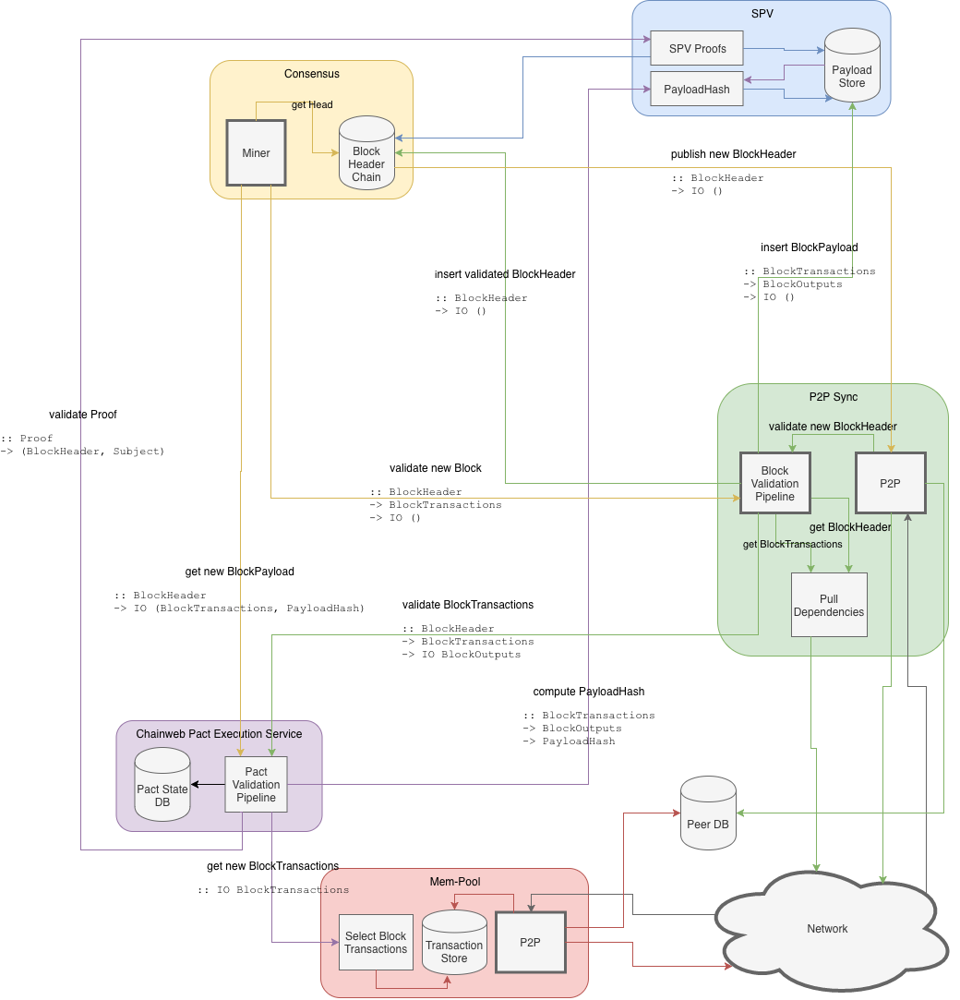

# Architecture of a Chainweb Node

This overview doesn't distinguish between a single-chain and a multi-chain node.
The same overall design applies in both cases.

Active components are are drawn with a bold border. Active components drive the
control flow of the overall system.

Passive components may still contain internal co-routines for asynchronous
processing. Also, all components provide REST APIs that serve external requests.

## Control Flow for Newly Mined Block

1.  The *Miner* discovers new a chain head. (In practice it is alerted via an STM
    event.)

2.  The *Miner* calls *Chainweb Pact Excecution Service (CPES)* for a new block
    payload.

3.  *CPES* calls *Mempool* to assemble new `BlockTransactions`.

4.  *CPES* internally calls Pact for validation and obtains `BlockOutputs`.

5.  *CPES* calls SPV library for computing the `PayloadHash`. (This is a pure
    library function that doesn't require any access to the state of the SPV component.)

6.  *CPES* returns the `BlockTransactions` and the `PayloadHash` to *Miner*,

7.  *Miner* starts mining the new block.

8.  When *Miner* finds a new block, it calls the *block header validation
    pipeline* of the *Sync* component with the new `BlockHeader` and `BlockTransactions`.

9.  *Sync* calls *CPES* for validation of the `BlockTransactions` of the new block.

10. *CPES* validates the new `BlockTransactions` and returns the
    `BlockOutputs`.

11. *Sync* calls *SPV* for storing the `BlockTransactions` and `BlockOutputs`
     and creating the Merkle indexes.

12. *Sync* calls *Consensus* for validating the new `BlockHeader` and storing
     it in the *Block Header Chain DB*.

13. *Consensus* triggers publication of the new `BlockHeader` via the P2P
     network.

## Control Flow for New Block from Peer

If a new block header is received from a peer the following happens:

1.  *P2P* receives a new `BlockHeader` from a peer and calls *Block Header
    Validation Pipeline* of *Sync* with `BlockHeader`.

2.  *Sync* calls *SPV* to get the `BlockTransactions`.

3.  If the `BlockTransactions` are not available, *Sync* internally calls the *Pull
    Dependencies* component for fetching missing `BlockTransactions`.

4.  *Sync* calls *Consensus* to get parent and adjacent parents block headers
    of the new `BlockHeader`.

5.  *Sync* internally calls *Pull Dependencies* for fetching missing parent
    or adjacent parent block headers. *Sync* enqueues the results in the
    *Block Header Validation Pipeline* before reinserting the currently
    processed `BlockHeader` into the pipeline, too.

6.  *Sync* calls *CPES* for validation the `BlockTransactions` (for the
    current `BlockHeader`).

7.  *CPES* validates the new `BlockTransactions` and returns the
    `BlockOutputs`.

8.  *Sync* calls *SPV* for storing the `BlockTransactions` and `BlockOutputs`
    and creating Merkle indexes.

9.  *Sync* calls *Consensus* for validating the new `BlockHeader` and storing
    it in the *Block Header Chain DB*.

10. *Consensus* triggers publication of the new `BlockHeader` via the P2P
    network.

Pact may call *SPV* library for validation of proofs. This is a cheap pure
library call, that doesn't require any access to the state of the SPV
component.

For proof validation Pact also calls *Consensus* to verify that the
`BlockHeaderHash` that is produced by the proof evaluation is in the "winning"
branch of the chain.

