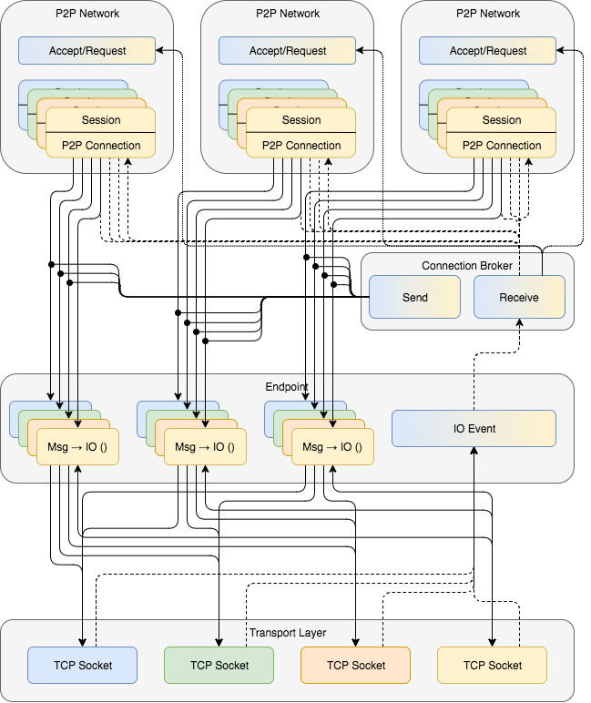

# Transport Layer Architecture

P2P networks are logically separated by chain. The transport is shared between
the P2P networks for all chains.

The Endpoint is provided by the network-transport-tcp package. This level may
be striped, so that there will be more than a single TCP connection per
physical peer, to reduce contention caused, in particular when remote peers
have to synchronize large amounts of data after a downtime or a network
partition.

The P2P Sessions are provided by the ChainDB Sync component. The P2P Connection
is the P2P connection handle that is defined in the module P2P.Connection and
initialed by the P2P.Node.p2pNode function.

The Connection Broker matches incoming and outgoing connections to logical P2P
networks and dispatches events and incoming messages to logical P2P
connections.

The Accept/Request component of each P2P network dispatches incoming
connections and requests new outgoing connections based on the P2P logic and
configuration. It actually implements the topological properties of the P2P
network.

## TCP Connection Sharing

The network-transport package doesn't exactly match our use-case. In particular,
it only supports uni-directional connections. The main advantage of using
tcp-transport is, that it supports sharing of TCP connections.

For just a small number of chains it would probably be simpler to just use one
TCP connections per P2P session.

For a large number of chains, say 1000 chains and a P2P-network degree of about
8 nodes a chainweb node would have to maintain around 8000-10,000 TCP
connections. In this scenario it's probably a good idea to share TCP connections
between different chains.

An open question is if the P2P logic needs to coordinate between different
chains for connection sharing to pay off. As a starting point we may just assume
that a similar discovery logic leads to sufficient sharing without explicit
coordination.

Sharing of TCP connection can come at the cost that P2P connections from
different chains race for bandwidth. network-transport allows to limit the size
of individual messages which could provide some fairness. This may also provide
an attack vectors, so we should be careful.

Also sharing of TCP connection move some of the overhead of TCP connections to
the application layer. We should measure how big this overhead is compared to
the gains.
